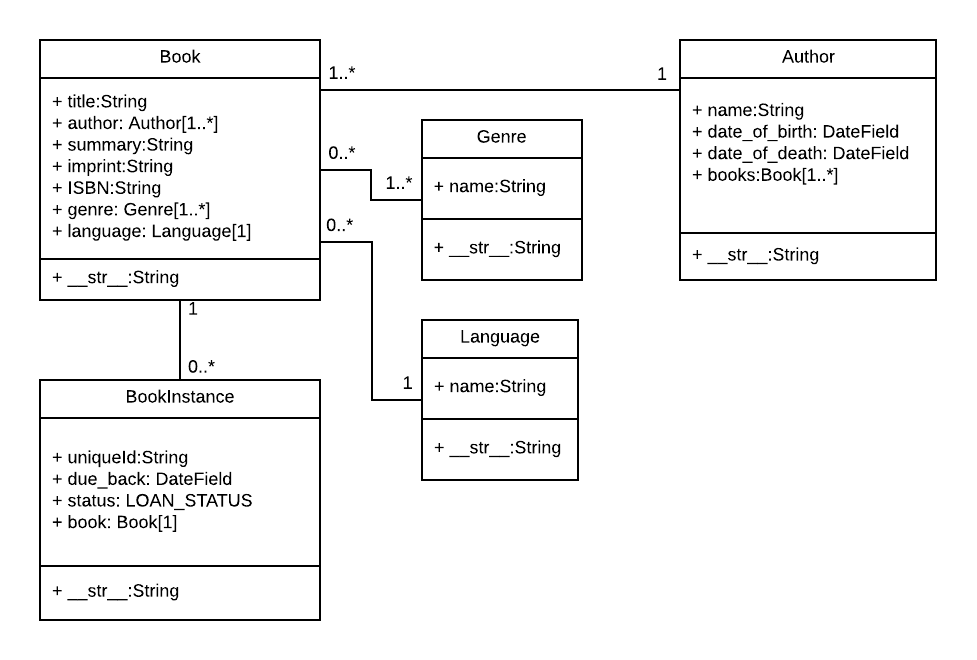
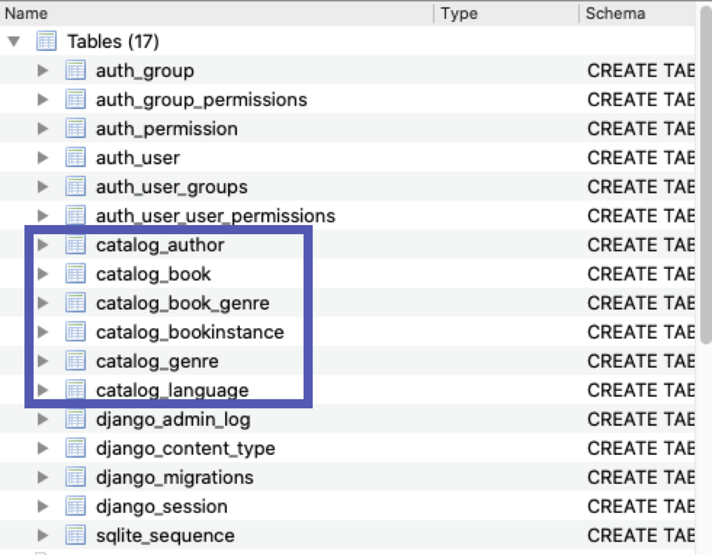
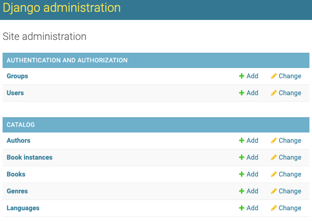

# <ins>加入第一個應用<ins>

線上圖書館的基本功能是借書，還書及查詢，我會叫這個功能做`catalog`。加入應用`catalog`到項目文件夾中。

```
python mange.py startapp catalog
```

加入應用後，文件夾新增了模組`catalog`。

```
online_library
    |------ db.sqlite3     
    |------ manage.py
    |------ online_library
    |------ catalog
               |------  admin.py        
               |------  __init__.py 
               |------  apps.py 
               |------  migrations
               |------  models.py 
               |------  tests.py
               |------  views.py
```

先了解`catalog`模組內的檔案內容：

| 檔案         | 內容                           |
| ---------- | ---------------------------- |
| models.py  | 設定數據庫的`schema`，例如：作者，書籍及語言等。 |
| views.py   | 配對`templates`，該應用在網上的樣子。     |
| migrations | 儲存每次數據庫更新的資料。                |
| admin.py   | 加入`Models`到`Admin Page`中     |

首先設定數據庫的`schema`，在`catalog`應用中，總共有五個數據表，以下有一個`UML`圖（來源為[MDN Django Tutorial](https://developer.mozilla.org/en-US/docs/Learn/Server-side/Django)）表達不同數據表所對應`model`的屬性`attribute`及方法`method`



以`Language` model為例，有一個屬性`name`，數據類別為字串`String`，有一個方法`__str__`，可以設定該model的instance在字串狀態下的值，使用`print()`就能在`console`上顯示該值，而且`Admin Page`會用該值代表其數據顯示在目錄上。

進入/catalog/models.py，建立`UML`上的五個models。

```python
class Language(models.Model):
    name = models.CharField(max_length=30, help_text="Language name. etc: chinese")
    def __str__(self):
        return self.name

class Genre(models.Model):
    name = models.CharField(max_length=30)
    def __str__(self):
        return self.name
```

Language 和 Genre Model都比較簡單，只有一個Field `name`。以下有本項目用到`Field`類別：

| 類別              | 內容                                              |
| --------------- | ----------------------------------------------- |
| CharField       | 和TextField分別在於，需要設定參數`max_|ength`               |
| TextField       | 屬於長文字，例如：書的內容                                   |
| DateTimeField   | 時間                                              |
| ManyToManyField | 一本書包含有多個類別，所以book model中的genre就是ManyToManyField |
| ForeignKey      | 假設書本只有一個作者，author就是book model中的ForeignKey       |

[可點擊此處詳閱類別內容。](https://docs.djangoproject.com/en/2.1/ref/models/fields/#field-types)

```python
class Author(models.Model):
    name = models.CharField(max_length=100)
    date_of_birth =models.DateTimeField(null=True,blank=True)
    date_of_death = models.DateTimeField(null=True,blank=True)
    def __str__(self):
        return self.name

class Book(models.Model):
    title = models.CharField(max_length=100)
    author = models.ForeignKey(Author, on_delete=models.SET_NULL,null=True)
    genre = models.ManyToManyField(Genre)
    language = models.ForeignKey(Language, on_delete=models.SET_NULL,null=True)
    isbn = models.CharField(max_length=13, help_text="<a href='https://zh.wikipedia.org/zh-hk/%E5%9B%BD%E9%99%85%E6%A0%87%E5%87%86%E4%B9%A6%E5%8F%B7'>click here for isbn detail<a>")
    summary = models.TextField()
    def __str__(self):
        return self.title

class BookInstance(models.Model):
    LOAN_STATUS = [
        ('m', 'Maintenance'),
        ('o', 'On loan'),
        ('a', 'Available'),
        ('r', 'Reserved'),
    ]
    book = models.ForeignKey(Book, on_delete=models.CASCADE,null=True)
    due_back = models.DateTimeField(blank=True, null=True)
    status = models.CharField(max_length=1,default='m',choices=LOAN_STATUS)
    def __str__(self):
        return f"{self.book} {self.status}"
```

每個都有一些參數可以調較。以下有本項目用到參數。

| 參數         | 內容                                                                                                       |
| ---------- | -------------------------------------------------------------------------------------------------------- |
| null       | 預設為`False`，例如：CharField空了會顯示空的字串`""`，轉為`True`後，數據空了會顯示為`NULL`。                                           |
| blank      | 預設為`False`，代表必須填寫其資料，轉為`True`後，就可以留空資料。                                                                  |
| on_delete  | 使用ForeignKey必要的參數，```models.CASCADE``代表當書本被移除，相應的```BookInstance`也會移除，`models.SET_NULL代表當語言被移除，相應的書本不會移除 |
| choices    | 能夠在`Admin Page`透過選擇視窗加入數據。                                                                               |
| max_length | 可用於CharField，TextField。設定字串長度。                                                                           |
| help_text  | 用`Admin Page`更改數據時，可以看到help_text作為提示，提示為`HTML`可以包含連結及其它模樣。                                               |

# 執行migration！

每當應用的數據庫有任何更改，例如：`catalog`新增了五個model，數據庫相應增加五個表。項目就需要進行`migration`，更新數據庫。

```python
python mange.py makemigrations
```

執行`makemigrations`後，/catalog/migrations新增一個python檔案`0001_initial.py`，準備更新數據庫的相關代碼，例如：`migrations.CreateModel`。

```python
python mange.py migrate
```

執行/catalog/migrations的`0001_initial.py`的指令，使用[DB Browser for SQLite](https://sqlitebrowser.org/)打開項目的數據庫檔案`db.sqlite3`。發現數據庫有17個數據表，包括`catalog` models的五個，另外一個是`ManyToManyRelationship`所生成的表，下章會再講解。



# 進入admin-page

Django其中一個大的優點是，能夠透過用戶介面`Admin Page`更改數據。進入`Admin Page`前，需要輸入以下代碼，開啟 `Admin`用户賬號。

```python
python manage.py createsuperuser
```

進入本地伺服器前，為了顯示`catalog`的`models`到`Admin Page`中，需要在/catalog/admin.py註冊五個所需`models`。

```python
from django.contrib import admin
from catalog.models import *

# Register your models here.
admin.site.register(Book)
admin.site.register(BookInstance)
admin.site.register(Language)
admin.site.register(Genre)
admin.site.register(Author)
```

開啟賬號及註冊`models`後，輸入以下代碼，進入本地伺服器，在網絡瀏覽器輸入http://127.0.0.1:8000/admin 便到達 `Admin Page`登入介面。

```python
python mange.py runserver
```

五個 `model` 岀現了！成功感up！！！覺得很神奇！！！這樣就可以透過`Admin Page`更改數據庫的數據了。

