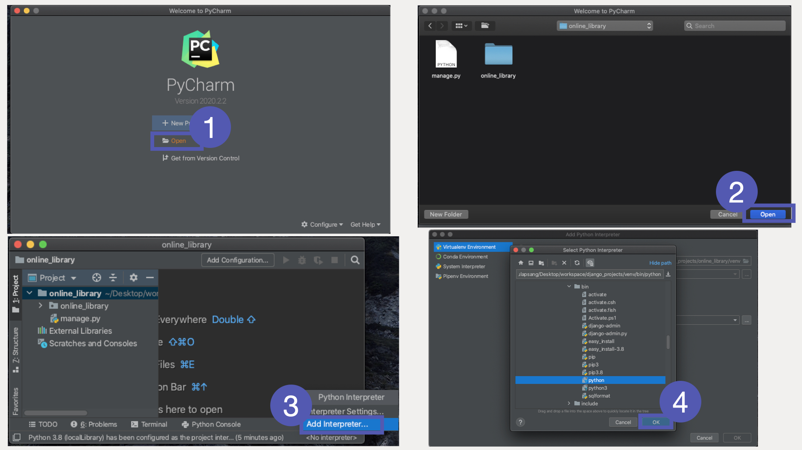
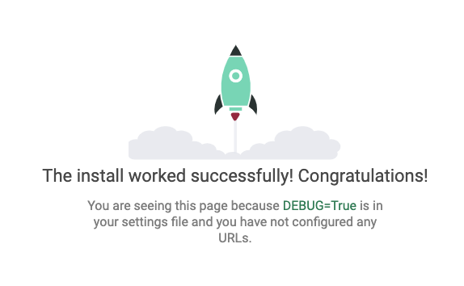

# 前言

一直對網頁開發很有興趣，都是在前端開發遊走 。首先學習`html/css/js` ，然後選擇了 `reactjs`前端框架，再製作了個人網頁。說起我對後端開發的認識，實踐上有很大的不足。我還記得在公司實習時，都嘗試過透過 Java `spring`框架打做網頁，由構架數據庫到前端設計。雖然網頁不太精良，但獲益良多。 實習完結後，我到了 Manulife 工作，工作內容跟網頁開發沒有太大關係。加上發現了 `Firebase` 及 一些 `CMS` 的存在，更加無法燃起學習後端框架的火。直到最近認識了很多對`Python`有興趣的朋友，我更對其中一個朋友誇下海口，教導他`Django`網頁開發框架。就是這樣硬生生地點起學習後端框架的火。我使用 Mac OS，Python 3.8.5 及 Django 3.1.2。本項目學習藍本為[MDN Django Tutorial](https://developer.mozilla.org/en-US/docs/Learn/Server-side/Django)，Shout out to `MDN`。

# 設置 Django 項目

首先打開 Terminal 前往自己 workspace 文件夾，並開啟一個子文件夾`django_projects`。然後在`django_projects`中建立虛擬環境`venv`。

```
cd /Users/Oscar Yiu/Desktop/workspace
mkdir django_projects
python3 -m venv ./django_projects/venv
```

進入文件夾`django_projects`，並激活虛擬環境`venv`，然後下載`Django`到虛擬環境`venv`。

```
cd django_projects
source ./venv/bin/activate
pip install django
```

最後透過以下指令建立我人生第一個`Django`項目`onlineLibrary`。開啟 PyCharm 打開文件夾 onlineLibrary 並設定 python interpreter 為 django_projects 中 venv/bin 的 python。

```
django-admin startproject online_library
```



# 本地伺服器！啟動！

在 PyCharm terminal 輸入以下代碼，以測試 Django 項目是否成功！

```
python manage.py runserver
```

點擊超連結<http://127.0.0.1:8000/>，如果網頁岀現火箭圖示，設置項目成功！正式打曲！！！！！



# 甚麼是 manage.py？

```
online_library
    |------ db.sqlite3
    |------ manage.py
    |------ online_library
```

在 `online_library`中有共三個檔案及文件夾，數據庫檔案，提供指令的`manage.py`及項目模組`online_library`。
在 PyCharm terminal 輸入以下代碼，就能知道有甚麼指令。

```
python manage.py -h
```

簡單介紹一下我做這項目會用的指令：

| 指令           | 內容                                                                                                                                   |
| -------------- | -------------------------------------------------------------------------------------------------------------------------------------- |
| startapp       | 建立新的應用，應用可以理解為功能，例如本項目為線上圖書館，如果將來想加入二手書買賣平台功能，有機會要建立兩個應用 `catalog`及`market`。 |
| makemigrations | 當數據庫有更新，例如：新增圖書的頁數，作為圖書數據表的一欄。此指令會製作相應的 SQL 指令。                                              |
| migrate        | 當執行 makemigrations 後，執行 migrate 以執行 makemigrations 製作的 SQL 指令。                                                         |
| shell          | 可以透過 terminal，使用應用的 model 以執行 SQL 指令。                                                                                  |
| collectstatic  | 進行 deployment 前，需要把 Static 檔案放到 staticfiles 文件夾，例如：/admin 的 js, css，在 production 環境能夠找到 Static 檔案。       |

# 甚麼是項目模組？

```
online_library
    |------ db.sqlite3
    |------ manage.py
    |------ online_library
                            |------ __init__.py
                            |------ asgi.py
                            |------ settings.py
                            |------ urls.py
                            |------ wsgi.py
```

`online_library`中有\_**\_init\_\_**.py，代表這是個 Python 的模組。`urls.py`是用作配對 url 及不同應用的 views，例如：Django 預設的/admin 就會配對到 `admin_view`。而 settings.py 就會包含`online_library`項目的設定：

| 設定           | 內容                                                                                               |
| -------------- | -------------------------------------------------------------------------------------------------- |
| SECRET_KEY     | 用作加密。在 production 要使用新一 SECRET_KEY，可以用`django.utils.crypto.get_random_string`生成。 |
| DEBUG          | Production 是 False，Development 是 True                                                           |
| ALLOWED_HOSTS  | 在 Production 使用，加入 deployment 的 domin。                                                     |
| INSTALLED_APPS | 每個所需的應用都要放在内。例如：admin                                                              |
| DATABASES      | 設定數據庫，例如：在 heroku 不支援 sqlite3，需要轉為其他數據庫。                                   |
| MIDDLEWARE     | Deployment 時候需要加入 `whitenoise.middleware.WhiteNoiseMiddleware`                               |
